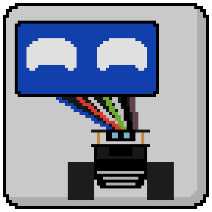

  
  <h1>Pet Robot Control</h1>
  <h2>A custom framework for a pet robot (populated with some functions)</h2>

  
  
  
  

## Introduction
The present repository is a collection of all programs and scripts to control my "pet robot". It is designed in a way to offer as many different inputs/outputs as possible without a predefined purpose. It is designed as a platform for trying out controllers and software.

If you want to run it, it is developed for running on a Raspberry Pi OS on the Raspberry Pi 4 8GB. Therefore no Windows support. You find all customly printed parts in the folder "PhysicalParts".

Here you can see the built robot.

## Required Hardware
The following image shows a list of all hardware modules connected to the boards and how to connect them. It consists of a display, microphone, speacer, camera, DC motors, servomotors, various sensors and different output devices.

## Arduino
The Arduino sketches are differentiated in the sensor and motor packages. They do not communicate directly, but only via the Raspberry Pi as the central control system. The Arduinos only act as signal interpreters and to forward generated data to the Raspberry Pi. A custom protocol has been created for communication between an Arduino and the Raspberry Pi.

## Raspberry Pi
The Raspberry Pi currently mainly acts as the aggregator for the data the Arduinos generate and to communicate movement signals to the motor system. It also can control the face generated on the display with a custom facial engine allowing to easily display a wide range of emotions with different intensity. In the future it will also aggregate microphone and video data, output via a speaker system, and serve a controller WebGUI via a Node.js server.

You can click on the image below to find a video showing the facial engine in action.

## Dependencies
https://github.com/eclipse/paho.mqtt.cpp

