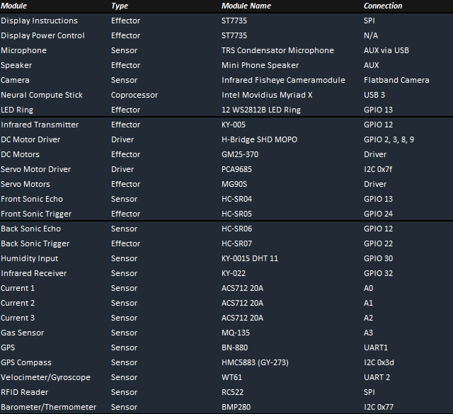

# Pet Robot Control

## Introduction
If you want to run it, it is developed for running on a Raspberry Pi OS on the Raspberry Pi 4 8GB.
Therefore no Windows support.

## Required Hardware

## Sensor Arduino

## Motor Arduino

## Raspberry Pi

## Utility Scripts

